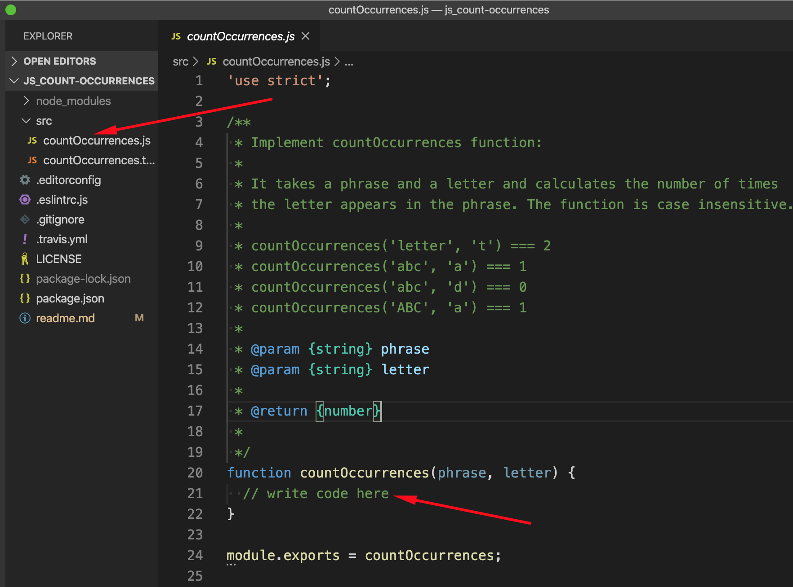
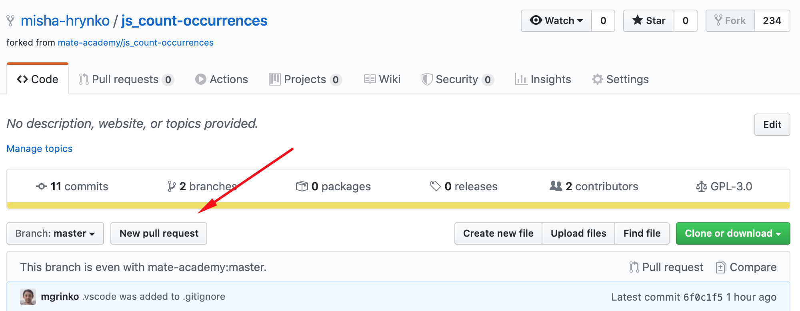
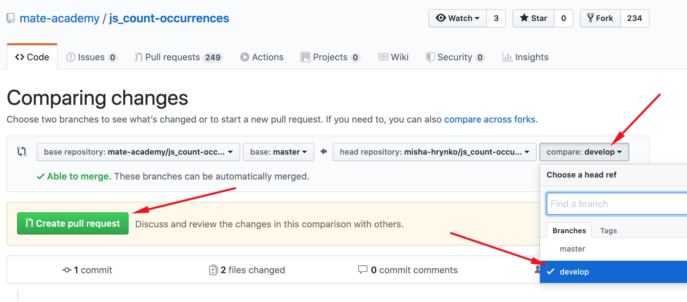
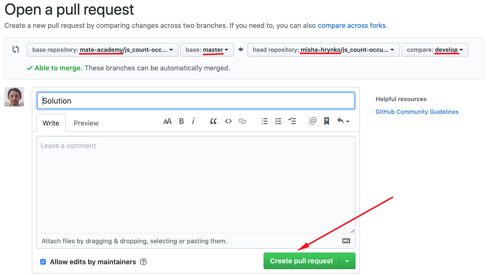

# Guideline how to implement solution for JS tasks
- Watch [video guide](https://youtu.be/Zv7jC4bRjOw)
- Learn eslint rules from [the simplified styleguide](https://mate-academy.github.io/style-guides/javascript-standard-modified)

## Prepare the project
1. Fork the repo (Github repository)
1. Clone the forked repo
    ```
    git clone the-link-from-your-forked-repo
    ```
    - You can get the link by clicking the `Clone or download` button in your repo
1. Open the project folder in your IDE
1. Open a terminal in the project folder
1. Create a branch for the solution and switch on it
    ```
    git checkout -b develop
    ```
    - You can use any other name instead of `develop`
1. Run `npm install` (or just `npm i`) to install the dependencies

## Implement the solution
1. Implement the solution within a function in `src/<task_name>.js`
    
1. Run `npm run test` (or just `npm test`) to check if your solution is correct
    - If at least one test fails fix the solution and check again.
1. Run `npm run lint` to see if your code follows the [the simplified styleguide](https://mate-academy.github.io/style-guides/javascript-standard-modified)
    - If you see some errors fix them and check again
1. Save the solution
    ```
    git commit -am 'Solution'
    ```
    - code style is automatically checked again when you `commit` the code
    - Fix all the errors before committing again
1. Push the solution to the repo
    ```
    git push origin develop
    ```
    - If you created another branch (not `develop`) use its name instead
    - The tests are run again before the push to ensure the solution still works
    - Fix all the test and commit before pushing again
    
## Create a Pull Request (PR)
1. Open your repo on Github and create a `Pull Request` (PR)
    
1. Select your branch in the dropdown
    
1. Verify the PR details and code (scroll down to see it) and confirm
    

## If a mentor requested changes on your PR
1. Repeat [Implement the solution](#implement-the-solution) section
1. PR is updated automatically after a push to your branch on Github
